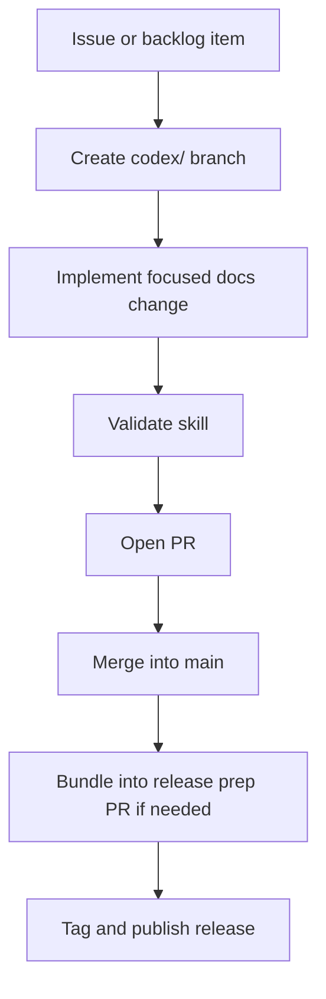

# Maintenance Notes

This document collects the small operational notes that make the repository easier to maintain between feature PRs and releases.

이 문서는 기능 PR과 릴리스 사이에 저장소를 안정적으로 유지하기 위한 운영 메모를 정리합니다.

## Repo Skill and Global Skill / 저장소 스킬과 전역 스킬

Canonical repo skill path:

정본 스킬 경로:

- `D:\UnityUICreater\unity-mcp-ui-layout`

Global Codex skill path:

전역 Codex 스킬 경로:

- `C:\Users\user\.codex\skills\unity-mcp-ui-layout`

### Recommended Local Sync / 권장 로컬 동기화

```powershell
robocopy D:\UnityUICreater\unity-mcp-ui-layout C:\Users\user\.codex\skills\unity-mcp-ui-layout /MIR
python C:\Users\user\.codex\skills\.system\skill-creator\scripts\quick_validate.py D:\UnityUICreater\unity-mcp-ui-layout
python C:\Users\user\.codex\skills\.system\skill-creator\scripts\quick_validate.py C:\Users\user\.codex\skills\unity-mcp-ui-layout
```

Use the repo copy as the source of truth. Sync the global copy only when you want to test the skill through Codex itself.

정본은 항상 저장소 복사본으로 취급합니다. 전역 스킬은 Codex에서 직접 테스트해야 할 때만 동기화합니다.

## Issue to Release Flow / 이슈부터 릴리스까지의 흐름



## Small Maintenance Rules / 운영 규칙

- keep one branch focused on one documentation theme
- update `README.md` when discoverability changes
- update `examples/README.md` or `references/README.md` when a new entry point is added
- do not let platform adapters drift too far from the core skill behavior
- prefer backlog cleanup during release prep instead of every tiny PR

- 한 브랜치에는 한 가지 문서 테마만 담습니다.
- 새 진입점이 생기면 `README.md`를 같이 업데이트합니다.
- 새 예시나 새 참조 문서가 생기면 `examples/README.md` 또는 `references/README.md`를 같이 갱신합니다.
- 플랫폼 어댑터가 코어 스킬과 너무 멀어지지 않게 유지합니다.
- backlog는 작은 PR마다 흔들기보다 릴리스 준비 단계에서 정리하는 편이 좋습니다.

## Lightweight Validation Checklist / 가벼운 검증 체크

- frontmatter is still valid and readable
- new rules are linked from the right navigation points
- examples reinforce the rules instead of contradicting them
- no new file silently became the only source of important guidance

- frontmatter가 여전히 정상 파싱되는지 확인합니다.
- 새 규칙이 올바른 진입점에서 연결되는지 확인합니다.
- examples가 규칙을 강화하는지, 모순되지 않는지 확인합니다.
- 중요한 규칙이 새 파일 한 곳에만 숨어버리지 않았는지 확인합니다.
