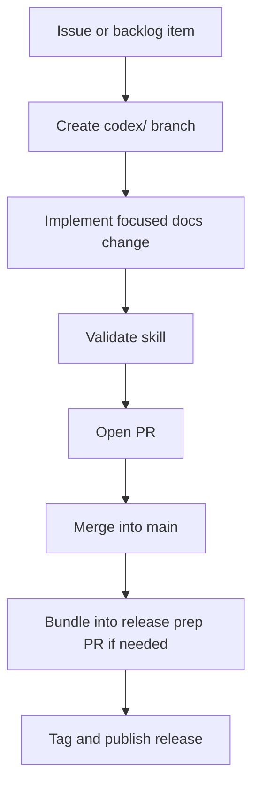

# Maintenance Notes

This document collects the small operational notes that make the repository easier to maintain between feature PRs and releases.

이 문서는 기능 PR과 릴리스 사이에 저장소를 안정적으로 유지하기 위한 운영 메모를 정리합니다.

## Repo Skill and Global Skill / 저장소 스킬과 전역 스킬

Canonical repo skill path:

정본 스킬 경로:

- `D:\UnityUICreater\unity-mcp-ui-layout`

Global Codex skill path:

전역 Codex 스킬 경로:

- `C:\Users\user\.codex\skills\unity-mcp-ui-layout`

### Recommended Local Sync / 권장 로컬 동기화

```powershell
robocopy D:\UnityUICreater\unity-mcp-ui-layout C:\Users\user\.codex\skills\unity-mcp-ui-layout /MIR
python C:\Users\user\.codex\skills\.system\skill-creator\scripts\quick_validate.py D:\UnityUICreater\unity-mcp-ui-layout
bash D:/UnityUICreater/tests/agent_runbook_keywords.sh
bash D:/UnityUICreater/tests/layout_snapshot_keywords.sh
bash D:/UnityUICreater/tests/mockup_layout_plan_schema.sh
bash D:/UnityUICreater/tests/review_gates_keywords.sh
bash D:/UnityUICreater/tests/trigger_keywords.sh
bash D:/UnityUICreater/tests/layer_tree_keywords.sh
bash D:/UnityUICreater/tests/item_rect_keywords.sh
bash D:/UnityUICreater/tests/item_candidate_keywords.sh
bash D:/UnityUICreater/tests/ui_toolkit_docs_keywords.sh
bash D:/UnityUICreater/tests/ui_toolkit_build_keywords.sh
bash D:/UnityUICreater/tests/ui_toolkit_forward_contract.sh
python -c "import yaml; [yaml.safe_load(open(path, encoding='utf-8')) for path in ['D:/UnityUICreater/templates/mockup-layout-plan.yaml', 'D:/UnityUICreater/examples/mockup-layout-plan-prefab-example.yaml', 'D:/UnityUICreater/examples/mockup-layout-plan-ui-toolkit-example.yaml']]"
Get-ChildItem D:\UnityUICreater\tests\*.sh | ForEach-Object { bash -n $_.FullName }
git diff --check
python C:\Users\user\.codex\skills\.system\skill-creator\scripts\quick_validate.py C:\Users\user\.codex\skills\unity-mcp-ui-layout
```

Use the repo copy as the source of truth. Sync the global copy only when you want to test the skill through Codex itself.

정본은 항상 저장소 복사본으로 취급합니다. 전역 스킬은 Codex에서 직접 테스트해야 할 때만 동기화합니다.

## Issue to Release Flow / 이슈부터 릴리스까지의 흐름


```mermaid
flowchart TD
    A["Issue or backlog item"] --> B["Create codex/ branch"]
    B --> C["Implement focused docs change"]
    C --> D["Validate skill"]
    D --> E["Open PR"]
    E --> F["Merge into main"]
    F --> G["Bundle into release prep PR if needed"]
    G --> H["Tag and publish release"]
```

## Small Maintenance Rules / 운영 규칙

- keep one branch focused on one documentation theme
- update `README.md` when discoverability changes
- update `examples/README.md` or `references/README.md` when a new entry point is added
- do not let platform adapters drift too far from the core skill behavior
- prefer backlog cleanup during release prep instead of every tiny PR

- 한 브랜치에는 한 가지 문서 테마만 담습니다.
- 새 진입점이 생기면 `README.md`를 같이 업데이트합니다.
- 새 예시나 새 참조 문서가 생기면 `examples/README.md` 또는 `references/README.md`를 같이 갱신합니다.
- 플랫폼 어댑터가 코어 스킬과 너무 멀어지지 않게 유지합니다.
- backlog는 작은 PR마다 흔들기보다 릴리스 준비 단계에서 정리하는 편이 좋습니다.

## Lightweight Validation Checklist / 가벼운 검증 체크

- Consult [the recorded live capability validation](docs/validation/2026-09-09-agent-capability-routing.md) for tested sessions, source hashes, the initial failure, and the follow-up. Preserve failed and corrected reports when adding runs; distinguish stored-evidence checks from new execution and document untested runtimes.
- For agent routing changes, review `examples/mixed-agent-ui-workflow-example.md`: missing vision, dropped image attachments, parent/child skill mismatch, generation-only workers, unavailable Unity access, artifact transfer, and stale evidence. Check both qualified role assignment and pending-check reporting; examples are not live cross-runtime verification.

- When planning or image-resource guidance changes, review the boundary scenarios in `examples/planned-ui-with-project-images-example.md` against the runbook and both new references. Check prior authorization, pending answers, direct discovery without indexes, generation declined/unavailable, no image-generation skill despite a callable image tool, and both UI stacks. These scenarios are expectations, not automated behavioral evidence.
- frontmatter is still valid and readable
- agent runbook keyword checks still cover trigger naming, task classification, Unity-state intake, input-mode notes, and final response checklist
- layout snapshot keyword checks still cover active root, UI stack, screenshot frame, fallback calls, and console state wording
- mockup layout plan schema checks still cover required sections and accept/hold/reject promotion rules
- review gates keyword checks still cover hard blockers, soft assumptions, no-human-review fallback, and candidate decision reporting
- trigger keyword checks still cover mockup/image-to-prefab request wording
- layer/tree keyword checks still cover mockup-to-Transform hierarchy wording
- item rect keyword checks still cover mockup item sizing and crop-plan wording
- item candidate keyword checks still cover candidate ledger and review-gate wording
- new rules are linked from the right navigation points
- examples reinforce the rules instead of contradicting them
- no new file silently became the only source of important guidance
- UI Toolkit public/discovery changes pass `tests/ui_toolkit_docs_keywords.sh` and keep stack selection before realization
- the three clean-context UI Toolkit forward scenarios remain recorded and passing through `tests/ui_toolkit_forward_contract.sh`
- the public UI Toolkit artifact path stays linked through `ui-stack-selection.md`, `ui-toolkit-build-workflow.md`, and `ui-toolkit-from-mockup-example.md`
- the neutral `mockup-layout-plan/v2` template and both canonical YAML examples remain linked and parseable
- UI Toolkit build, reusable UXML/USS, runtime-host qualification, screenshot, and console verification guidance remains synchronized
- run YAML parsing, `bash -n`, and `git diff --check` when these public documents change

- [실제 기능 검증 기록](docs/validation/2026-09-09-agent-capability-routing.md)의 세션·소스 해시·최초 실패·재검증을 확인합니다. 새 실행을 추가할 때 실패와 수정 후 보고서를 모두 보존하고, 저장 근거 검사와 새 실행 및 미검증 런타임을 구분합니다.
- frontmatter가 여전히 정상 파싱되는지 확인합니다.
- 계획·이미지 리소스 지침 변경 시 `examples/planned-ui-with-project-images-example.md`의 경계 사례를 runbook 및 연결된 참조 문서와 대조합니다. 예제는 기대 동작이며 자동 행동 검증 결과가 아닙니다.
- agent runbook keyword check가 trigger naming, task classification, Unity-state intake, input-mode note, final response checklist를 계속 커버하는지 확인합니다.
- layout snapshot keyword check가 active root, UI stack, screenshot frame, fallback call, console state 문구를 계속 커버하는지 확인합니다.
- mockup layout plan schema check가 required section과 accept/hold/reject promotion rule을 계속 커버하는지 확인합니다.
- review gates keyword check가 hard blocker, soft assumption, no-human-review fallback, candidate decision reporting을 계속 커버하는지 확인합니다.
- mockup/image-to-prefab 요청 표현을 trigger keyword check가 계속 커버하는지 확인합니다.
- mockup-to-Transform hierarchy 표현을 layer/tree keyword check가 계속 커버하는지 확인합니다.
- mockup item sizing과 crop-plan 표현을 item rect keyword check가 계속 커버하는지 확인합니다.
- candidate ledger와 review-gate 표현을 item candidate keyword check가 계속 커버하는지 확인합니다.
- 새 규칙이 올바른 진입점에서 연결되는지 확인합니다.
- examples가 규칙을 강화하는지, 모순되지 않는지 확인합니다.
- 중요한 규칙이 새 파일 한 곳에만 숨어버리지 않았는지 확인합니다.
- UI Toolkit public/discovery 변경이 `tests/ui_toolkit_docs_keywords.sh`를 통과하고 realization 전에 stack selection을 유지하는지 확인합니다.
- 중립 `mockup-layout-plan/v2` template과 두 정본 YAML 예시가 계속 링크되고 파싱되는지 확인합니다.
- UI Toolkit build, 재사용 가능한 UXML/USS, runtime-host qualification, screenshot, console 검증 지침이 동기화되어 있는지 확인합니다.
- 공개 문서가 바뀌면 YAML parsing, `bash -n`, `git diff --check`를 실행합니다.

## Execution Contract Validation

When decision rules, plan geometry, or packaging changes, run `ruby tests/layout_plan_semantics_test.rb` and `bash tests/mockup_layout_plan_schema.sh`. Keep `templates/mockup-layout-plan.yaml` byte-identical to the packaged `unity-mcp-ui-layout/templates/mockup-layout-plan.yaml`. Run all shell checks, YAML parsing, skill validation, and `git diff --check` for cross-cutting skill changes. Keyword checks validate documentation coverage only; the historical forward fixture does not run a fresh agent. Record new forward evaluations separately with inputs, observed decisions, and limitations; never relabel historical evidence as a current run.
