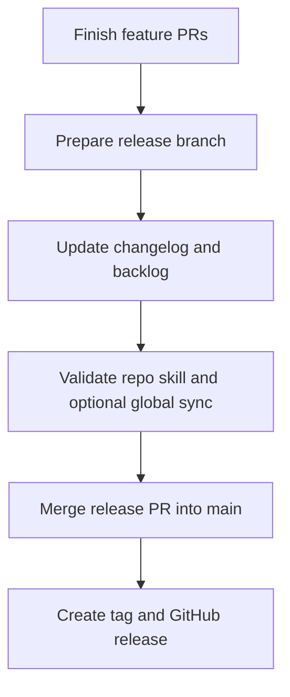

# Release Checklist

Use this checklist when preparing a tagged release for this repository.

이 문서는 이 저장소에서 태그 릴리스를 준비할 때 사용하는 짧은 체크리스트입니다.

## Scope Check / 범위 점검

- confirm which issues and PRs are meant to land in the release
- keep the release branch focused on release prep, changelog updates, and lightweight sync work
- avoid mixing a new feature-sized documentation change into the release-prep branch

- 이번 릴리스에 포함할 이슈와 PR을 먼저 확정합니다.
- 릴리스 브랜치는 changelog, backlog, 플랫폼 동기화 같은 정리 작업 위주로 유지합니다.
- 릴리스 준비 브랜치에 새로운 큰 기능성 문서 변경을 섞지 않습니다.

## Documentation Sync / 문서 동기화

- update `CHANGELOG.md`
- refresh `BACKLOG.md` so already-shipped work is removed or reprioritized
- check whether `README.md` needs new discoverability links
- if the core skill behavior changed, make sure `Platform/` adapters still reflect the same workflow

- `CHANGELOG.md`를 업데이트합니다.
- 이미 반영된 작업이 backlog에 남아 있지 않도록 `BACKLOG.md`를 정리합니다.
- 새 문서 진입점이 생겼다면 `README.md` 링크를 보강합니다.
- 코어 스킬 동작이 바뀌었다면 `Platform/` 어댑터도 같은 워크플로를 반영하는지 확인합니다.

## Validation / 검증

- validate the repo skill
- run agent runbook keyword checks when the agent operating sequence, mode notes, or final response checklist changed
- run layout snapshot keyword checks when Unity UI intake, snapshot contracts, or smaller-call fallback wording changed
- run mockup layout plan schema checks when the plan template, example, candidate promotion rules, or validator changed
- run review gates keyword checks when hard blocker, soft assumption, no-human-review, or candidate decision reporting guidance changed
- run trigger keyword checks when discoverability or skill activation wording changed
- run layer/tree keyword checks when mockup decomposition or hierarchy guidance changed
- run item rect keyword checks when mockup item sizing, source rect, or crop-plan guidance changed
- run item candidate keyword checks when candidate ledger, confidence, or human review gate guidance changed
- run `tests/ui_toolkit_docs_keywords.sh` when stack selection, public/discovery routing, platform prompts, or UI Toolkit completion guidance changed
- run `tests/ui_toolkit_build_keywords.sh` when UI Toolkit build/reuse/verification guidance changed
- run `tests/ui_toolkit_forward_contract.sh` when reviewing the three clean-context UI Toolkit forward scenarios or their durable evidence contract
- run YAML parsing when `templates/mockup-layout-plan.yaml` or either canonical plan example changed
- run `bash -n` across shell tests and `git diff --check` for every documentation-only release candidate
- if you use the global skill for local testing, sync it once and validate again
- quickly read the changed entry points as if you were a first-time user
- make sure new examples still match the actual rules

- 저장소 안의 정본 스킬을 검증합니다.
- agent operating sequence, mode note, final response checklist가 바뀌었다면 agent runbook keyword check를 실행합니다.
- Unity UI intake, snapshot contract, smaller-call fallback 문구가 바뀌었다면 layout snapshot keyword check를 실행합니다.
- plan template, example, candidate promotion rule, validator가 바뀌었다면 mockup layout plan schema check를 실행합니다.
- hard blocker, soft assumption, no-human-review, candidate decision reporting 지침이 바뀌었다면 review gates keyword check를 실행합니다.
- discoverability나 스킬 작동 트리거 문구가 바뀌었다면 trigger keyword check를 실행합니다.
- mockup decomposition이나 hierarchy 지침이 바뀌었다면 layer/tree keyword check를 실행합니다.
- mockup item sizing, source rect, crop-plan 지침이 바뀌었다면 item rect keyword check를 실행합니다.
- candidate ledger, confidence, human review gate 지침이 바뀌었다면 item candidate keyword check를 실행합니다.
- stack selection, public/discovery routing, platform prompt, UI Toolkit completion 지침이 바뀌었다면 `tests/ui_toolkit_docs_keywords.sh`를 실행합니다.
- UI Toolkit build/reuse/verification 지침이 바뀌었다면 `tests/ui_toolkit_build_keywords.sh`를 실행합니다.
- `templates/mockup-layout-plan.yaml` 또는 두 정본 plan 예시가 바뀌었다면 YAML parsing을 실행합니다.
- 모든 shell test에 `bash -n`을 실행하고 문서 릴리스 후보마다 `git diff --check`를 실행합니다.
- 전역 스킬로도 테스트한다면 한 번 동기화한 뒤 다시 검증합니다.
- 처음 보는 사용자라고 가정하고 바뀐 진입 문서를 빠르게 다시 읽습니다.
- 새 examples가 실제 규칙과 어긋나지 않는지 확인합니다.

## Suggested Commands / 권장 명령

```powershell
python C:\Users\user\.codex\skills\.system\skill-creator\scripts\quick_validate.py D:\UnityUICreater\unity-mcp-ui-layout
bash D:/UnityUICreater/tests/agent_runbook_keywords.sh
bash D:/UnityUICreater/tests/layout_snapshot_keywords.sh
bash D:/UnityUICreater/tests/mockup_layout_plan_schema.sh
bash D:/UnityUICreater/tests/review_gates_keywords.sh
bash D:/UnityUICreater/tests/trigger_keywords.sh
bash D:/UnityUICreater/tests/layer_tree_keywords.sh
bash D:/UnityUICreater/tests/item_rect_keywords.sh
bash D:/UnityUICreater/tests/item_candidate_keywords.sh
bash D:/UnityUICreater/tests/ui_toolkit_docs_keywords.sh
bash D:/UnityUICreater/tests/ui_toolkit_build_keywords.sh
bash D:/UnityUICreater/tests/ui_toolkit_forward_contract.sh
python -c "import yaml; [yaml.safe_load(open(path, encoding='utf-8')) for path in ['D:/UnityUICreater/templates/mockup-layout-plan.yaml', 'D:/UnityUICreater/examples/mockup-layout-plan-prefab-example.yaml', 'D:/UnityUICreater/examples/mockup-layout-plan-ui-toolkit-example.yaml']]"
Get-ChildItem D:\UnityUICreater\tests\*.sh | ForEach-Object { bash -n $_.FullName }
git diff --check
robocopy D:\UnityUICreater\unity-mcp-ui-layout C:\Users\user\.codex\skills\unity-mcp-ui-layout /MIR
python C:\Users\user\.codex\skills\.system\skill-creator\scripts\quick_validate.py C:\Users\user\.codex\skills\unity-mcp-ui-layout
```

## Release Flow / 릴리스 흐름



## Final Checks / 마지막 확인

- release title matches the actual scope
- tag version is consistent with `CHANGELOG.md`
- merged PRs are reflected in the release note summary
- the working tree is clean before tagging

- 릴리스 제목이 실제 범위와 맞는지 확인합니다.
- 태그 버전과 `CHANGELOG.md` 버전이 일치하는지 확인합니다.
- 머지된 PR이 릴리스 요약에 반영됐는지 확인합니다.
- 태그 생성 전에 작업 트리가 깨끗한지 확인합니다.
