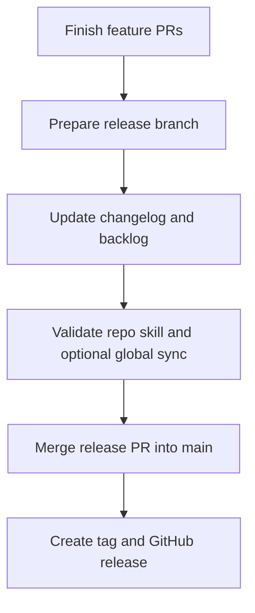

# Release Checklist

Use this checklist when preparing a tagged release for this repository.

이 문서는 이 저장소에서 태그 릴리스를 준비할 때 사용하는 짧은 체크리스트입니다.

## Scope Check / 범위 점검

- confirm which issues and PRs are meant to land in the release
- keep the release branch focused on release prep, changelog updates, and lightweight sync work
- avoid mixing a new feature-sized documentation change into the release-prep branch

- 이번 릴리스에 포함할 이슈와 PR을 먼저 확정합니다.
- 릴리스 브랜치는 changelog, backlog, 플랫폼 동기화 같은 정리 작업 위주로 유지합니다.
- 릴리스 준비 브랜치에 새로운 큰 기능성 문서 변경을 섞지 않습니다.

## Documentation Sync / 문서 동기화

- update `CHANGELOG.md`
- refresh `BACKLOG.md` so already-shipped work is removed or reprioritized
- check whether `README.md` needs new discoverability links
- if the core skill behavior changed, make sure `Platform/` adapters still reflect the same workflow

- `CHANGELOG.md`를 업데이트합니다.
- 이미 반영된 작업이 backlog에 남아 있지 않도록 `BACKLOG.md`를 정리합니다.
- 새 문서 진입점이 생겼다면 `README.md` 링크를 보강합니다.
- 코어 스킬 동작이 바뀌었다면 `Platform/` 어댑터도 같은 워크플로를 반영하는지 확인합니다.

## Validation / 검증

- validate the repo skill
- if you use the global skill for local testing, sync it once and validate again
- quickly read the changed entry points as if you were a first-time user
- make sure new examples still match the actual rules

- 저장소 안의 정본 스킬을 검증합니다.
- 전역 스킬로도 테스트한다면 한 번 동기화한 뒤 다시 검증합니다.
- 처음 보는 사용자라고 가정하고 바뀐 진입 문서를 빠르게 다시 읽습니다.
- 새 examples가 실제 규칙과 어긋나지 않는지 확인합니다.

## Suggested Commands / 권장 명령

```powershell
python C:\Users\user\.codex\skills\.system\skill-creator\scripts\quick_validate.py D:\UnityUICreater\unity-mcp-ui-layout
robocopy D:\UnityUICreater\unity-mcp-ui-layout C:\Users\user\.codex\skills\unity-mcp-ui-layout /MIR
python C:\Users\user\.codex\skills\.system\skill-creator\scripts\quick_validate.py C:\Users\user\.codex\skills\unity-mcp-ui-layout
```

## Release Flow / 릴리스 흐름



## Final Checks / 마지막 확인

- release title matches the actual scope
- tag version is consistent with `CHANGELOG.md`
- merged PRs are reflected in the release note summary
- the working tree is clean before tagging

- 릴리스 제목이 실제 범위와 맞는지 확인합니다.
- 태그 버전과 `CHANGELOG.md` 버전이 일치하는지 확인합니다.
- 머지된 PR이 릴리스 요약에 반영됐는지 확인합니다.
- 태그 생성 전에 작업 트리가 깨끗한지 확인합니다.
