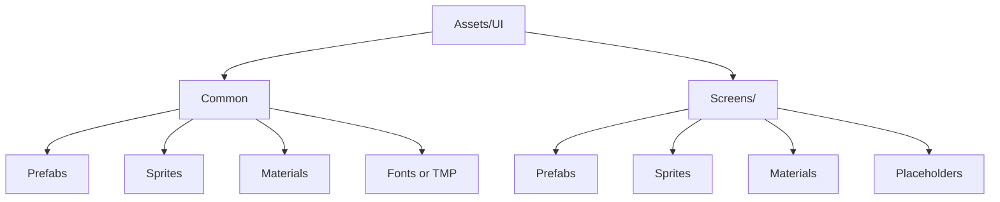

# Asset Naming and Folder Rules

Use this guide when asset-aware mode creates, promotes, or reorganizes UI assets.

The goal is simple: if an agent creates or extracts a useful asset today, another agent should be able to find and reuse it later without guessing.

If you need concrete before/after trees and variant folder examples, pair this guide with `asset-naming-examples.md`.

## 1. Core Naming Principles

- Prefer short names that reveal role immediately.
- Encode UI purpose and scope, not editor history.
- Keep shared assets clearly separate from screen-specific assets.
- Name assets by meaning, not by pixel position or target resolution.
- If an asset is only provisional, mark it clearly as placeholder work.

Good names help discovery, reuse, and safe prefab promotion.

Bad names create accidental duplication.

Avoid names like:

- `Button_New`
- `Panel_Final2`
- `InventorySlot_Copy`
- `TopLeft_1920_Button`
- `Popup_v3_really_final`

## 2. Scope First: Shared vs Screen-Specific

Before naming or placing a new asset, decide its scope.

- Put the asset in a shared folder only if the structure, styling intent, and likely reuse all point toward cross-screen reuse.
- Keep the asset in a screen-specific folder when it mainly serves one screen, one feature flow, or one temporary production stage.
- If scope is unclear, prefer screen-specific placement first. Promote to shared only after reuse is visible.

## 3. Recommended Folder Shape

Use a predictable folder layout so retrieval can stay stable.

Recommended examples:

- `Assets/UI/Common/Prefabs`
- `Assets/UI/Common/Sprites`
- `Assets/UI/Common/Materials`
- `Assets/UI/Common/TMP`
- `Assets/UI/Screens/HUD/Prefabs`
- `Assets/UI/Screens/Inventory/Prefabs`
- `Assets/UI/Screens/Popup/Placeholders`

The exact project folder shape can vary, but the intent should stay clear:

- shared things live in shared locations
- screen-owned things live near that screen
- placeholder work stays visibly provisional

## 4. Recommended Naming Patterns

Choose one stable family pattern and keep it consistent.

### Prefabs

- Shared base prefab: `UI_Common_Button_Primary`
- Shared reusable row: `UI_Common_StatusRow`
- Screen-specific prefab: `UI_Inventory_Slot`
- Screen-specific popup root: `UI_Settings_PopupRoot`

### Prefab Variants

- `UI_Common_Button_Primary_Selected`
- `UI_Common_Button_Primary_Disabled`
- `UI_Reward_Card_Epic`

Keep the base family name intact and append only the scoped difference.

### Sprites

- `UI_Common_Icon_Gold`
- `UI_Inventory_Frame_Rare`
- `UI_HUD_BarFill_HP`

### Materials

- `UI_Common_Grayscale`
- `UI_Popup_BlurOverlay`

### TMP Styles or Font Assets

- `TMP_Common_Title_L`
- `TMP_Common_Body_M`
- `TMP_HUD_Number_L`

## 5. Naming Rules for Reuse Promotion

When a repeated structure is promoted into a reusable prefab:

- Name the prefab by role, not by current scene position.
- Keep screen ownership out of the name if the asset is truly cross-screen.
- Keep screen ownership in the name if reuse is still local to one screen family.
- Avoid baking state names into the base asset if the state should be a variant instead.

Use:

- `UI_Common_ItemCard`
- `UI_Inventory_ItemCard`

Avoid:

- `UI_LeftPanelCard`
- `InventoryCard_01`
- `RareCardBaseMaybe`

## 6. Folder Rules for Variants and Wrappers

When using variants or wrappers:

- Keep variants near the base prefab family so reuse remains discoverable.
- Use a `Variants` subfolder only if the family is large enough to justify it.
- Keep thin wrappers close to the screen that owns the wrapper behavior.

Examples:

- `Assets/UI/Common/Prefabs/Buttons/UI_Common_Button_Primary.prefab`
- `Assets/UI/Common/Prefabs/Buttons/Variants/UI_Common_Button_Primary_Selected.prefab`
- `Assets/UI/Screens/Inventory/Prefabs/UI_Inventory_ItemCardHost.prefab`

## 7. Placeholder Rules

Placeholders are allowed, but they must stay easy to replace.

- Put placeholders in a clearly provisional folder when possible.
- Use `Placeholder` in the asset name when the visual is intentionally temporary.
- Do not let placeholder assets silently become permanent shared assets.

Examples:

- `UI_Inventory_Placeholder_ItemIcon`
- `UI_Popup_Placeholder_Background`

## 8. Anti-Patterns

Avoid these:

- putting one-screen assets into `Common` too early
- storing reusable prefabs inside one random screen folder
- naming assets by coordinates or resolution
- mixing several naming styles for the same asset family
- leaving extracted reusable assets with clone or copy names
- turning placeholder assets into de facto design-system assets without cleanup

## 9. Review Questions

Ask:

- If this asset were needed again next week, would another agent know where to look?
- Does the name reveal what the asset is and whether it is shared or screen-scoped?
- Is the folder location consistent with the intended reuse boundary?
- Did we create a shared asset only because it is actually shared?
- Are placeholder assets still visibly marked as provisional?

If the answer is no, rename or relocate the asset before calling the work done.
