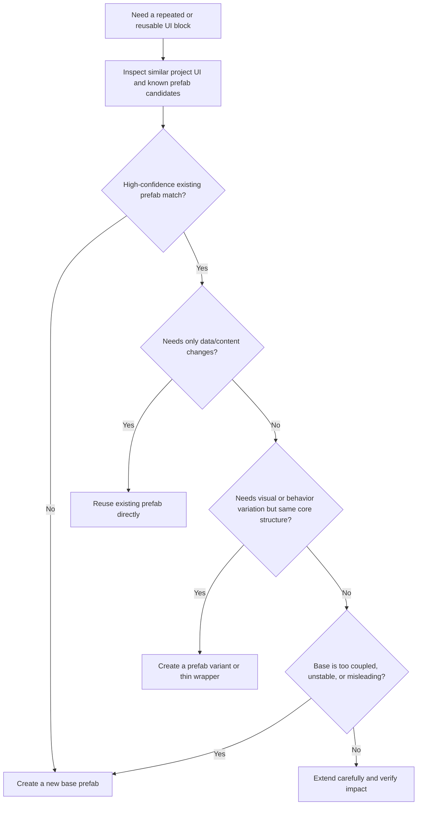

# Existing Prefab Reuse Rules

Use this guide when the project may already contain a similar UI prefab and the safer choice might be reuse, variant creation, or a small extension instead of building a new asset from scratch.

If the best answer is "same base, but scoped divergence", pair this guide with `prefab-variants.md`.

## Goal

Prefer stable reuse over duplication by checking whether a similar project prefab already exists, deciding whether it should be reused directly, turned into a variant, or replaced by a new base prefab, and keeping that decision explicit.

## Decision Flow

## Reuse Priority

Prefer this order:

1. reuse an existing stable prefab
2. create a variant or thin wrapper around it
3. create a new base prefab

Do not jump to a new prefab first unless the existing candidates are clearly unsuitable.

## Inspect First

Before deciding:

- Look for visually similar widgets already used in the scene or nearby screens.
- Check whether those widgets are truly prefab-backed reusable assets or only scene-local assemblies.
- Inspect whether the candidate already covers the same hierarchy, sizing logic, state model, and interaction pattern.
- Distinguish between data differences and structural differences.
- Check whether the candidate is already used widely enough that direct edits carry shared risk.

## Reuse Directly When

- The existing prefab already matches the same role and hierarchy.
- The changes are mostly text, icon, number, state, or small content-level swaps.
- The current screen wants to stay consistent with other existing screens.
- Direct reuse reduces duplication without hiding new constraints.

## Prefer a Variant or Wrapper When

- The core structure is the same, but visuals or behavior differ in a controlled way.
- The base prefab should remain reusable for multiple screens.
- You need a special style, state, or optional section that should not pollute the base prefab for everyone else.
- You want to preserve upgrade paths from the base prefab while isolating screen-specific overrides.

## Prefer a New Base Prefab When

- Existing candidates are structurally misleading and would require heavy override work.
- The candidate has too many unrelated dependencies or brittle assumptions.
- The new UI pattern is likely to become the clearer shared standard going forward.
- Forcing reuse would create hidden coupling or make maintenance harder than a clean new base.

## Safe Modification Rules

If an existing prefab is already shared:

- Treat direct edits as high-impact until proven otherwise.
- Check where else it appears before modifying core hierarchy, spacing ownership, anchors, or component assumptions.
- Prefer variants, wrappers, or smaller extracted sub-blocks when the requested change is screen-specific.
- After a base prefab edit, verify the current target plus at least one other known usage.

## Tool Strategy

Use a bounded sequence:

1. Inspect the current scene and similar UI candidates with `editor_state`, `find_gameobjects`, and any available asset-aware retrieval.
2. If asset-aware mode is active, look for similar reusable prefabs before creating replacements.
3. Compare the best candidate against the requested role: direct reuse, variant, wrapper, or new base.
4. Use `manage_prefabs` for prefab creation or modification.
5. Use `manage_gameobject` and `manage_components` only for scene placement or small candidate normalization.
6. If behavior components are involved, update them with `manage_script`, then run `refresh_unity` and inspect `read_console`.
7. Verify the target screen and one shared usage path with `manage_camera` when direct reuse or base edits were chosen.

## UGUI Rules

- Good reuse candidates: item slot, reward card, stat row, quest row, party plate, shared popup button group, shop entry, tab item, badge stack.
- Keep screen-edge placement in the parent container even when reusing an existing prefab.
- If the parent uses a `LayoutGroup`, preserve parent ownership of repeated placement.
- Do not push screen-specific offsets back into the reused base prefab just to solve one screen.
- If the base prefab already mixes too many responsibilities, prefer extracting a smaller reusable sub-block before adding more overrides.

## UI Toolkit Equivalent

For UI Toolkit, apply the same decision logic to reusable `UXML` structures, `VisualElement` blocks, or shared `USS`-class-driven patterns:

- reuse the existing template/class combination when structure already matches
- create a small variant pattern when the base is still right but needs scoped overrides
- create a new shared block only when reuse would be misleading or too coupled

## Common Anti-Patterns

- Creating a new prefab without checking whether the project already has the same widget.
- Editing a shared base prefab for a one-screen request that should have used a variant.
- Reusing an existing prefab only because the name sounds similar even though the hierarchy or state model is wrong.
- Overriding so many parts of a base prefab that a clean new base would have been clearer.
- Fixing one screen by pushing screen-specific anchors or spacing into a widely shared prefab.

## Verification Questions

- Did you inspect existing reusable candidates before deciding to create a new prefab?
- Is the decision clear: direct reuse, variant/wrapper, or new base?
- If you reused a shared prefab directly, did you verify another known usage path?
- If you created a variant, does the base remain clean and generally reusable?
- If you created a new base prefab, was that actually simpler and safer than forced reuse?
