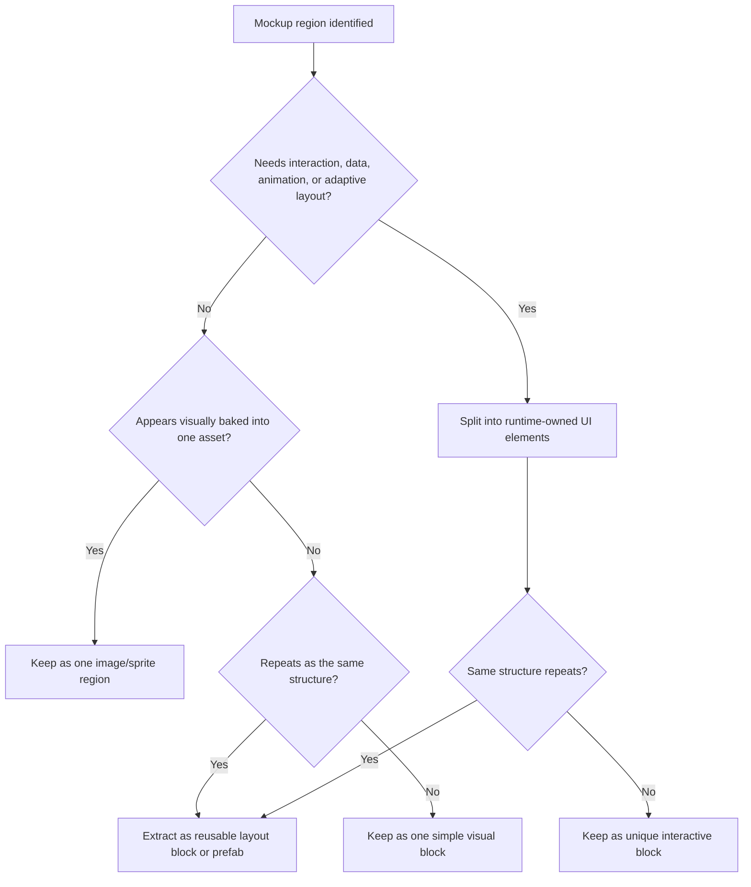

# Mockup Decomposition Rules

Use this guide when a mockup or design image exists and you need to decide which regions should stay as one asset, which should become reusable layout blocks, and which should be separated into interactive UI elements.

## Goal

Decompose the mockup only as far as runtime behavior needs. Keep the hierarchy honest, avoid fake widget explosion, and preserve reusable structure where the design clearly repeats.

## Core Rule

Decompose by runtime responsibility, not by visual outline alone.

- keep decorative or baked regions whole when they do not need separate behavior
- split elements that need interaction, dynamic text, animation, state changes, or adaptive layout
- promote repeated structures into reusable blocks or prefabs instead of rebuilding them by hand

## Decomposition Flow

## Keep As One Region When

- The area is mostly decorative.
- The design looks like one baked panel, illustration, or ornament.
- No sub-part needs its own click, hover, state, text swap, or animation.
- Splitting it would only create fake child objects that mirror visual shapes but not runtime meaning.

## Split Into UI Elements When

- A sub-part is clickable or selectable.
- A label, number, icon, or badge changes at runtime.
- A region needs to resize or reflow with resolution or content.
- A child needs a separate state such as selected, locked, disabled, highlighted, or empty.
- Safe area, localization, or adaptive layout requires independent control.

## Promote To Reusable Blocks When

- The same card, slot, row, badge cluster, or button group repeats.
- The same shape appears across screens with mostly data-level differences.
- The repeated structure would be fragile if rebuilt manually each time.

## Decomposition Priorities

Prefer this order:

1. screen-level anchor-owned regions
2. reusable repeated blocks
3. unique interactive elements
4. decorative single-image regions

Do not start by tracing every visible edge in the mockup into a separate node.

## Warning Signs Of Over-Decomposition

- Many empty `Image` objects exist only to mimic visual seams.
- Decorative borders or background ornaments are split into many children without runtime purpose.
- A single card frame becomes a deep tree of static fragments.
- The hierarchy grows faster than the actual interactive responsibilities.
- The screen only "matches the mockup" because many raw offsets compensate for fake visual layers.

## Warning Signs Of Under-Decomposition

- A button is baked into a background image but needs interaction.
- Dynamic text is trapped inside a decorative combined asset.
- A repeated list item is still being rebuilt from loose children each time.
- A region that should adapt to content stays locked as a flat image.

## Review Questions

- Which regions are decorative only, and should remain whole?
- Which regions need runtime ownership and must be split?
- Which repeated structures should become reusable prefabs or layout blocks?
- Did we decompose based on behavior and layout needs, not just visual outlines?
- Would another engineer understand why each region exists at runtime?
