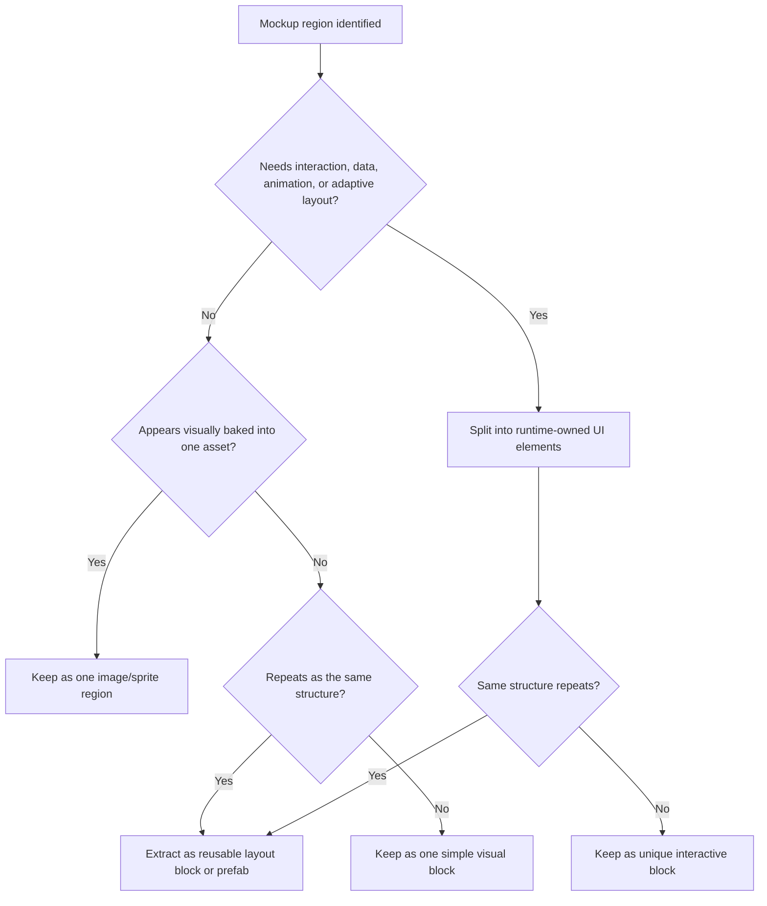

# Mockup Decomposition Rules

Use this guide when a mockup, screenshot, design image, or UI 시안 exists and you need to decide which regions should stay as one asset, which should become reusable layout blocks or Unity UI prefabs, and which should be separated into interactive UI elements.

Use `../../templates/mockup-layout-plan.yaml` when the decomposition needs a concise machine-readable artifact for layer tree, candidate review, item rect, asset crop, and verification target decisions.

## Goal

Decompose the mockup only as far as runtime behavior needs. Keep the hierarchy honest, avoid fake widget explosion, and preserve reusable structure where the design clearly repeats.

## Layer-To-Transform Tree Contract

Every mockup decomposition should end with a parent-owned transform hierarchy, not only a list of visual parts.

For each layer in the layer stack, name:

- role: background, safe-area owner, region, repeated group, runtime leaf, or decorative image layer
- owner: which parent controls position, scale, spacing, scroll, clipping, and safe area
- Unity node: the intended `Transform`, `RectTransform`, prefab root, or UI Toolkit `VisualElement`
- split reason: interaction, dynamic data, state, animation, localization, adaptive layout, or reuse
- keep-whole reason: baked art, decoration, no independent runtime behavior, or asset reuse

Infer candidate layers in raster-only mockups from containment, alignment, repeated shapes, shared baselines, shadows or panels, text/icon clusters, and obvious overlay depth.

Use this ordering for a Unity Transform tree or RectTransform tree:

1. screen shell and safe-area owner
2. major parent-owned regions
3. scroll, overlay, modal, or fixed-chrome owners
4. reusable repeated groups or prefab roots
5. runtime leaves
6. decorative leaves that stay whole

If a proposed child cannot name its parent ownership or runtime reason, keep it inside the nearest existing layer instead of creating a new node.

Draw order is not the same as parent hierarchy. A background may draw behind a region while living as the first child of that region; an overlay may draw above the screen while still belonging under a modal or overlay root. Preserve draw order through sibling order, canvas sorting, or z-order rules only after the parent-owned transform hierarchy is clear.

## Item Rect Contract

When a mockup region becomes a runtime or repeated item, record an item-level UI rect before creating or tuning the Unity object.

Do not map an item rect until its parent ownership and runtime split reason are named. This keeps item rect planning subordinate to the layer-to-Transform tree instead of turning the mockup into a leaf-first crop list.

If candidate extraction was used, treat the candidate ledger as not a final manifest. A candidate can be promoted only after parent ownership and split reason are reviewed.

For each candidate, record:

- `candidate_review_state`: `accept`, `hold`, or `reject`
- confidence band: `low`, `medium`, or `high`
- evidence: visible containment, repeated structure, shared baseline, text/icon cluster, shadow/panel boundary, or user hint
- decision note: why the candidate should become an item rect, stay inside a larger image, or wait for manual review

Use accept/hold/reject instead of silently deleting uncertain candidates. Accepted candidates may become item-level UI rect entries. Held candidates remain review notes. Rejected candidates should not create Unity objects or mockup-derived crops.

The template policy is strict: accepted candidates may become item rect entries after parent ownership and split reason are reviewed, held candidates remain notes, and rejected candidates must not create Unity objects, prefab children, or crops.

For each runtime or repeated item, record:

- item id and intended node path
- source rect in the mockup image: `x`, `y`, `width`, and `height`
- normalized rect relative to the mockup image size
- parent-local rect or fit mode after parent ownership is known
- split/keep reason tied to runtime behavior, dynamic data, state, animation, adaptive layout, reuse, baked art, or decoration
- asset/crop plan: existing sprite or prefab reuse, mockup-derived crop, 9-slice candidate, placeholder, or keep-whole image

Only apply this contract to items that deserve separate runtime or reuse ownership. Do not create rect entries for decorative sub-parts inside baked art just because their edges are visible. If a decorative region stays whole, record the outer region rect and keep internal shapes inside the same image or sprite.

## Core Rule

Decompose by runtime responsibility, not by visual outline alone.

- keep decorative or baked regions whole when they do not need separate behavior
- split elements that need interaction, dynamic text, animation, state changes, or adaptive layout
- promote repeated structures into reusable blocks or prefabs instead of rebuilding them by hand

## Decomposition Flow

## Keep As One Region When

- The area is mostly decorative.
- The design looks like one baked panel, illustration, or ornament.
- No sub-part needs its own click, hover, state, text swap, or animation.
- Splitting it would only create fake child objects that mirror visual shapes but not runtime meaning.

## Split Into UI Elements When

- A sub-part is clickable or selectable.
- A label, number, icon, or badge changes at runtime.
- A region needs to resize or reflow with resolution or content.
- A child needs a separate state such as selected, locked, disabled, highlighted, or empty.
- Safe area, localization, or adaptive layout requires independent control.

## Promote To Reusable Blocks When

- The same card, slot, row, badge cluster, or button group repeats.
- The same shape appears across screens with mostly data-level differences.
- The repeated structure would be fragile if rebuilt manually each time.

## Decomposition Priorities

Prefer this order:

1. screen-level anchor-owned regions
2. parent-owned transform hierarchy
3. reusable repeated blocks
4. unique interactive elements
5. decorative single-image regions

Do not start by tracing every visible edge in the mockup into a separate node.

## Warning Signs Of Over-Decomposition

- Many empty `Image` objects exist only to mimic visual seams.
- Decorative borders or background ornaments are split into many children without runtime purpose.
- A single card frame becomes a deep tree of static fragments.
- The hierarchy grows faster than the actual interactive responsibilities.
- The screen only "matches the mockup" because many raw offsets compensate for fake visual layers.

## Warning Signs Of Under-Decomposition

- A button is baked into a background image but needs interaction.
- Dynamic text is trapped inside a decorative combined asset.
- A repeated list item is still being rebuilt from loose children each time.
- A region that should adapt to content stays locked as a flat image.

## Review Questions

- Which regions are decorative only, and should remain whole?
- Which regions need runtime ownership and must be split?
- Which repeated structures should become reusable prefabs or layout blocks?
- Does the layer stack become a readable Unity Transform tree or RectTransform tree?
- Are 레이어 구조 and 트리 구조 aligned with parent ownership rather than visual outline alone?
- For each split runtime or repeated item, is there an item-level UI rect with source rect, normalized rect, parent-local rect or fit mode, and asset/crop plan?
- Did we decompose based on behavior and layout needs, not just visual outlines?
- Would another engineer understand why each region exists at runtime?
