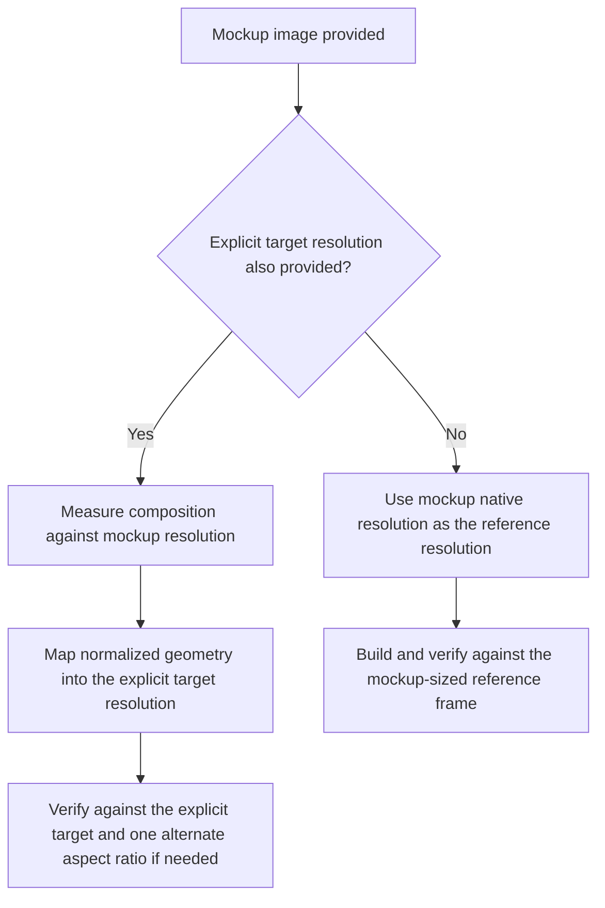

# Mockup Resolution Rules

Use this guide when the user provides a mockup, screenshot, wireframe, or design image and the image's own pixel resolution should influence how the UI is planned.

## Goal

Use the mockup's native pixel resolution as an intentional reference frame instead of silently falling back to an arbitrary default such as `1920x1080`.

## Core Rule

- If the user provides a mockup image and no explicit target resolution, use the mockup image's native resolution as the reference resolution.
- If the user provides both a mockup image and an explicit target resolution, keep both:
  - use the mockup resolution as the composition measurement space
  - use the explicit target resolution as the implementation and verification space

## Decision Flow

## Practical Rules

- Do not default to `1920x1080` if the mockup already has a clear pixel size and the user did not override it.
- If the user says "make it according to the mockup resolution", treat the mockup resolution as the primary reference frame.
- If the user gives both a mockup and a target device resolution, do not confuse them:
  - the mockup tells you composition and spacing intent
  - the target resolution tells you the actual implementation frame
- Always convert geometry through normalized ratios rather than copying raw mockup pixels directly.
- If the mockup is obviously a reduced export of a known target device, prefer the explicitly known target device resolution while still preserving the mockup's normalized layout relationships.

## Measurement Rules

When the mockup resolution is known:

- estimate `x`, `y`, `width`, and `height` relative to the mockup dimensions first
- treat those values as composition ratios
- only after that convert them into anchors, offsets, and size constraints for the target frame

This keeps the UI aligned with the design intent instead of overfitting to one arbitrary set of absolute numbers.

## Item-Level Rect Mapping

When a mockup-driven task splits runtime leaves, repeated item units, icons, cards, slots, or buttons, keep item-level rects in the same two-space model:

- source rect: `x`, `y`, `width`, and `height` measured in the mockup image coordinate space
- normalized rect: source rect divided by the mockup width and height
- target rect: the expected implementation-space bounds after applying the normalized rect to the target resolution or parent owner
- parent-local rect: the same item measured relative to its parent region when parent ownership is already known

Use item-level source rect values to preserve size relationships, then convert through normalized or parent-local ratios before setting Unity anchors, offsets, preferred sizes, or `LayoutElement` values.

Do not mix source rect pixels and target rect pixels in the same calculation. If the target frame differs from the mockup frame, raw source pixels are evidence only, not final Unity values.

## Common Mistakes

- ignoring the mockup resolution and silently planning everything around `1920x1080`
- mixing mockup pixels and target pixels as if they were the same coordinate space
- copying raw pixel coordinates from the mockup without normalizing first
- using item-level source rect pixels as final target rect values after the implementation resolution changes
- treating a mockup export size as meaningless even when it is the only explicit resolution evidence available

## Verification Questions

- Did we capture the mockup's native resolution before planning?
- If no explicit target resolution was given, did we use the mockup resolution instead of an arbitrary default?
- If both mockup and target resolutions exist, did we keep their roles separate?
- Were geometry estimates normalized before turning them into anchors and offsets?
- For item-level sizing, were source rect, normalized rect, target rect, and parent-local rect roles kept separate?
