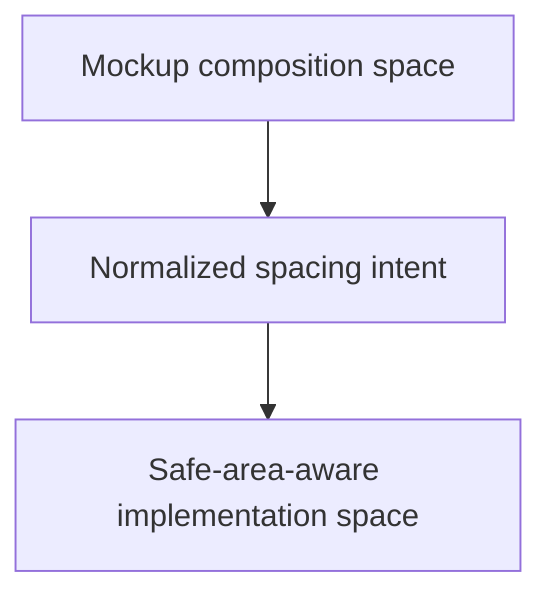

# Mockup to Safe Area Mapping

Use this guide when a mockup or screenshot was designed without device cutouts, but the implementation target is a mobile screen that must respect safe area constraints.

The goal is not to copy the mockup's raw top and bottom pixels.
The goal is to preserve the intended composition while reinterpreting edge spacing inside the safe area.

## 1. Core Rule

When a mockup has no notch or home-indicator constraints:

- treat the mockup as a composition reference
- treat the device safe area as the implementation boundary
- remap edge spacing into the safe area instead of preserving raw screen-edge distance

Do not keep a header "40 px from the physical top of the screen" if that would push it into unsafe space.

## 2. Separate Two Spaces

Always think in two spaces:

- Mockup space tells you the intended hierarchy and spacing rhythm.
- Safe-area-aware implementation space tells you where the runtime UI may actually live.

## 3. Reinterpret Edge Distance, Do Not Copy It

If the mockup shows:

- a top bar 36 px below the top edge
- a bottom action row 28 px above the bottom edge

Do not blindly preserve those exact edge distances on a phone with a notch or home indicator.

Instead:

1. identify the owning parent container
2. apply safe area at the correct parent
3. preserve the mockup's internal spacing rhythm inside that parent

That means the top bar becomes "36 px below the top of the safe area-owned container", not "36 px below the physical screen edge".

## 4. Safe Area Ownership Rules

- Full-screen mobile UI: safe area usually belongs on `SafeAreaRoot`
- Modal popup: safe area belongs on `PopupRoot`
- Do not distribute safe area compensation across many leaf widgets
- Do not combine one global safe-area owner with several manual child corrections unless the design truly requires it

## 5. What Stays Stable From the Mockup

Keep these stable where possible:

- top/bottom/left/right/center ownership
- section hierarchy
- relative spacing within a cluster
- modal composition balance
- button grouping rhythm

These survive the mapping better than raw edge pixels.

## 6. What Must Adapt

These often need reinterpretation:

- top banners near the notch
- bottom CTA bars near the home indicator
- close buttons in popup corners
- decorative edge art that assumes a rectangular full screen
- ultra-tight top or bottom padding copied from the mockup

## 7. Practical Workflow

When implementing from a mobile mockup:

1. capture the mockup resolution
2. identify whether the mockup visibly includes device safe area constraints
3. if not, mark it as notch-agnostic composition
4. decide the correct safe-area owner
5. rebuild edge spacing relative to the safe-area owner, not the physical screen edge
6. verify both portrait and landscape if the product is expected to support both

## 8. Anti-Patterns

Avoid these:

- preserving raw top-edge pixels from a notch-free mockup on a notched phone
- applying safe area once globally and then compensating again on each top control
- leaving popup close buttons aligned to unsafe corners because the mockup looked clean there
- treating the safe area like an optional polish pass after all placement is done

## 9. Review Questions

Ask:

- Was the mockup interpreted as composition guidance rather than raw device-edge geometry?
- Does safe area ownership belong to one correct parent instead of many children?
- Were top and bottom edge distances remapped into the safe area correctly?
- Does the mobile result preserve the mockup's visual hierarchy even though absolute edge pixels changed?

If the answer is no, the layout is probably still overfit to the mockup image instead of the real device boundary.
