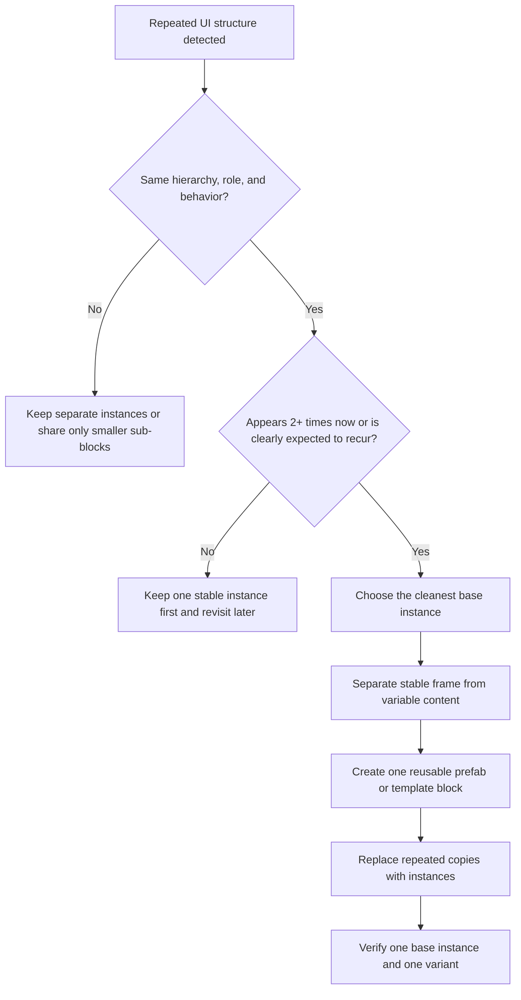

# Prefab Reuse Rules

Use this guide when the same UI shape appears more than once and should become one reusable prefab or reusable template block instead of repeated manual reconstruction.

If the project may already contain a similar reusable asset, pair this guide with `existing-prefab-reuse.md` before creating a new base prefab.

## Goal

Stabilize repeated UI work by extracting one reusable structure, keeping screen-level placement outside the prefab where possible, and varying only the parts that truly change.

## Promotion Flow

## Promote to a Prefab When

- The same row, card, slot, badge, tab, or button cluster appears two or more times on the same screen.
- The same structure is likely to recur across related screens such as inventory, shop, rewards, or quest lists.
- The differences between copies are mostly data-level changes such as text, icon, count, color state, or small toggles.
- Visual consistency matters more than per-instance freedom.
- Rebuilding each copy manually would increase drift risk.

## Do Not Promote Yet When

- The element is a one-off hero block or a unique composition centerpiece.
- The candidate copies already diverge heavily in hierarchy, spacing, or behavior.
- You still do not know which instance should be the canonical base.
- The region is likely one baked image asset and does not need structural reuse.
- The repeated structure is temporary exploration work and the layout model is still unstable.

## Extraction Rules

1. Choose the cleanest instance as the base.
2. Separate stable structure from variable fields such as label text, icon sprite, amount, state badge, or selected state.
3. Keep screen-edge ownership outside the prefab whenever possible. The parent container should usually decide top, bottom, left, right, or center placement.
4. Keep local anchors inside the prefab relative to the prefab root, not relative to the full screen.
5. Let either the parent layout group or the prefab internals own spacing deliberately. Do not let both fight for the same axis.
6. Prefer one well-structured prefab plus small data or state variation over many nearly identical prefabs.
7. If a decorative region is likely one sprite, keep it as one image inside the prefab unless runtime behavior requires further separation.

## Tool Strategy

Use a bounded sequence:

1. Inspect repeated candidates with `editor_state`, `find_gameobjects`, or existing scene context.
2. Normalize one candidate with `manage_gameobject` and `manage_components`.
3. Create or update the reusable asset with `manage_prefabs`.
4. Replace repeated copies with prefab instances instead of rebuilding them manually.
5. If the prefab depends on scripts or binding components, update them through `manage_script`, then run `refresh_unity` and inspect `read_console`.
6. Verify the base instance and at least one variant with `manage_camera`.

## UGUI Rules

- Good candidates: inventory slots, reward cards, quest rows, party member plates, buff icons, repeated popup buttons, shop entries, and tab buttons.
- Do not bake full-screen `anchoredPosition` assumptions into the prefab unless the prefab itself is intended to be the screen-level root block.
- Prefer placing prefab instances inside stable region containers such as `HUDRoot`, `InventoryGrid`, `PopupRoot`, or a list content root.
- If the parent uses a `LayoutGroup`, let the parent own repeated placement and keep per-instance offsets minimal.
- If the prefab owns an internal `LayoutGroup`, keep child spacing local to that prefab and avoid overriding it per instance.
- For repeated visual states, prefer one prefab with variant data or state toggles over multiple cloned prefabs with identical structure.

## UI Toolkit Equivalent

UI Toolkit does not use GameObject prefabs in the same way. Treat reusable repeated structures as template-equivalent blocks:

- Reuse one `UXML` structure or a clearly class-driven `VisualElement` block.
- Move repeated spacing, sizing, and alignment into `USS` classes.
- Keep screen-level placement in outer containers, not in each repeated child block.
- Avoid copying the same inline style cluster to many elements when a reusable class or template should own it.

## Common Anti-Patterns

- Creating a new prefab for every row when one prefab with data variation would do.
- Encoding screen-edge anchors inside the prefab instead of in the placement parent.
- Mixing parent `LayoutGroup` ownership with heavy per-instance manual offsets.
- Promoting a structure before the first clean instance exists.
- Splitting a likely single sprite into many fake child widgets just because the mockup visually contains sub-shapes.

## Verification Questions

- If you change the base structure once, do all copies stay consistent?
- Does one variant still work when text, icon, or count changes?
- Are repeated instances placed by their parent container rather than by screen-specific offsets inside the prefab?
- Does the prefab still behave correctly at the reference resolution and one alternate aspect ratio?
- Did you avoid creating many near-duplicate prefabs where one base prefab should exist?
