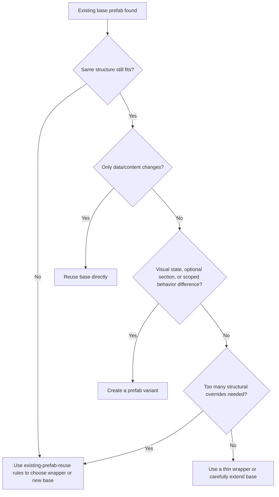

# Prefab Variant Rules

Use this guide when an existing base prefab is structurally correct, but the requested UI needs scoped visual, behavioral, or optional-content differences that should not be pushed into the base for every screen.

## Goal

Keep shared prefab families stable by using variants for controlled divergence, limiting overrides to the minimum necessary surface, and avoiding one-screen fixes that pollute the base prefab.

## Variant Decision Flow

## Use a Variant When

- The base hierarchy still matches the requested role.
- The screen needs a different visual state, style, rarity frame, emphasis level, or optional child block.
- The requested differences should stay local to one screen, mode, or feature family.
- You want inheritance from the base prefab without duplicating the full structure.

## Do Not Use a Variant When

- The requested UI no longer fits the base hierarchy.
- The variant would override so many properties that the base relationship becomes misleading.
- The difference is only data-level content and can be handled by normal instance configuration.
- The change should become the new shared standard for every usage of the base prefab.

## Override Discipline

Prefer overriding in this order:

1. visuals and content defaults
2. optional child visibility
3. scoped behavior toggles
4. local layout details inside the prefab root

Avoid overriding in this order unless truly necessary:

1. screen-edge anchors
2. parent-owned layout assumptions
3. shared component contracts
4. core hierarchy shape that defines the base prefab's meaning

## Safe Variant Rules

- Keep screen-level placement in the parent container, not in the variant.
- Preserve the base prefab's contract: expected child roles, binding points, component assumptions, and state ownership.
- Use variants to isolate screen-specific differences, not to quietly fork the base prefab into a second unrelated standard.
- If a variant needs many structural exceptions, stop and reconsider whether a wrapper or new base prefab is cleaner.
- After changing the base prefab, verify at least one variant that depends on it.
- After changing a variant, verify the base still behaves as expected if shared assets or scripts were touched.

## Good Variant Candidates

- common button -> danger button / primary button / reward claim button
- inventory slot -> selected slot / rare slot / locked slot
- reward card -> premium reward card / event reward card
- popup button row -> compact popup row / emphasized confirm row
- quest row -> tracked quest row / completed quest row

## Poor Variant Candidates

- a layout that moves from list row to card grid and no longer shares the same structure
- a prefab that now needs different parent layout ownership
- a screen that requires many unique children unrelated to the original base role
- a case where only text, icon, and count differ and normal reuse was enough

## Tool Strategy

Use a bounded sequence:

1. Inspect the base prefab and current target usage.
2. Confirm that the difference is variant-worthy rather than direct reuse or a new base.
3. Create or update the prefab variant with `manage_prefabs`.
4. Keep scene placement changes in `manage_gameobject`, not in the variant asset unless the variant root itself needs local layout changes.
5. If variant-specific behavior depends on scripts or component settings, update them with `manage_script`, then run `refresh_unity` and inspect `read_console`.
6. Verify the variant in the target screen and verify that the base prefab family still behaves coherently with `manage_camera`.

## UGUI Rules

- Do not solve one screen's edge alignment by pushing full-screen anchor overrides into the variant.
- If the parent uses a `LayoutGroup`, keep repeated placement parent-owned across base and variants.
- Variant-local changes should usually stay inside the prefab root: icon treatment, optional badges, text emphasis, decorative frames, minor internal spacing.
- When a button family or card family exists, prefer one base prefab plus a few clear variants over many unrelated near-duplicates.

## UI Toolkit Equivalent

For UI Toolkit, use the same logic for reusable template families:

- keep one base `UXML` structure
- apply variant-like differences through scoped classes, optional elements, or wrapper containers
- avoid copying the base into many almost-identical template files unless inheritance is no longer meaningful

## Common Anti-Patterns

- Creating a variant when direct reuse with different content was enough.
- Putting one-screen anchor fixes into the variant asset.
- Overriding so much of the base that the variant is effectively a hidden fork.
- Editing the base prefab for a local request that should have been solved by a variant.
- Creating many variants with unclear responsibility instead of a small, readable family.

## Verification Questions

- Is the base prefab still the correct conceptual parent for this variant?
- Could this have been direct reuse with data changes only?
- Are the overrides limited and easy to explain?
- Does the variant keep screen-level placement outside the asset?
- If the base changes later, will this variant still inherit in a predictable way?
