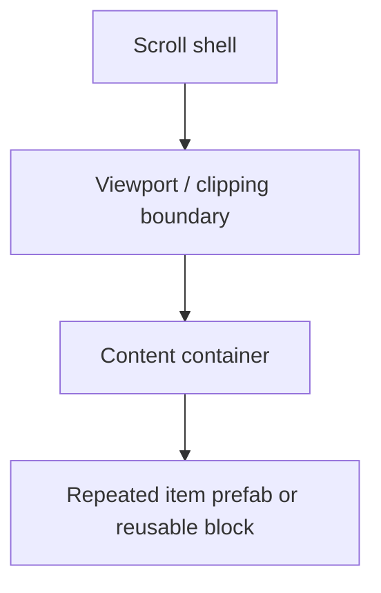

# Scroll View Patterns

Use this guide when a mockup or existing UI clearly behaves like a scrollable list, feed, picker, catalog, or stacked card surface.

The main rule is simple:

- treat the scroll shell as structure
- treat repeated items as reusable units
- keep scroll ownership deliberate and singular

## 1. Recognize Scroll-View Signals Early

Likely signals:

- a masked window with content that continues beyond the visible frame
- repeated rows, cards, slots, or cells inside one bounded panel
- scrollbars, fade edges, or visible clipping at the viewport boundary
- long content that should move while headers, tabs, or footers stay fixed

If those signals exist, decide the scroll owner and repeated-item strategy before styling leaf elements.

## 2. Separate Scroll Shell From Repeated Item

Do not treat the whole scroll view like one repeated prefab.

Use this ownership split instead:

- the scroll shell owns overall footprint, direction, and input behavior
- the viewport owns clipping
- the content container owns stacking or grid placement
- the repeated item owns row/card/cell structure and local styling

If the repeated unit appears multiple times, build one reusable item first, then populate the content container with instances.

## 3. UGUI Pattern

For UGUI, prefer this structure when the design is scroll-heavy:

`ScrollRect -> Viewport -> Content -> repeated item`

- `ScrollRect` owns scroll direction, movement type, elasticity, and scrollbar wiring
- `Viewport` owns masking and the visible window
- `Content` owns the `VerticalLayoutGroup`, `HorizontalLayoutGroup`, or `GridLayoutGroup`
- repeated rows/cards/cells should be prefab-like units or reusable layout blocks under `Content`

Use `LayoutElement` on the repeated item when one row or card needs size overrides.

Do not hand-place each repeated child inside `Content` unless the design truly requires non-uniform manual composition.

## 4. UI Toolkit Pattern

For UI Toolkit, prefer the same logical split even if the exact components differ:

- one deliberate scroll owner
- one content container inside that owner
- one reusable row/card structure represented as a reusable `VisualElement` pattern or `UXML` template

The scroll owner should decide overflow behavior.
The content container should decide vertical or horizontal stacking.
The repeated item should decide local alignment, icon/text arrangement, and per-row spacing.

Do not scatter scroll behavior across multiple nested containers unless nested scrolling is a real product requirement.

## 5. Reuse Rules

- If the same row/card/cell structure appears more than once, treat it as a reusable item.
- If the only differences are text, icon, count, or state, prefer instance-level content changes over new structural variants.
- If one screen needs a local item variation, prefer a scoped variant, wrapper, or local template adjustment over rewriting the shared base.
- Keep the scroll shell stable even when item content changes.

The repeated unit is usually the reusable asset, not the whole scroll view shell.

## 6. Common Failure Patterns

### The whole list is rebuilt by hand

- repeated children are manually positioned one by one
- gaps drift between rows
- one mockup update forces many structural edits

Fix direction:

- extract one repeated item
- let the content container own placement
- keep per-item differences at the content level

### The wrong object owns scrolling

- a parent and child both try to scroll
- the content area clips unexpectedly
- headers or footers move when they should stay fixed

Fix direction:

- choose one scroll owner
- keep clipping at the viewport boundary
- keep non-scrolling chrome outside the content container

### Repeated items are not treated as reusable units

- each row carries different structure for no good reason
- local fixes multiply across similar items
- layout drift grows as the list gets longer

Fix direction:

- normalize one base row/card/cell pattern
- push local style into the repeated unit
- keep the content container responsible only for placement and spacing

## 7. Verification Questions

Ask:

- Is there one clear scroll owner?
- Does the viewport only clip, instead of also trying to own repeated-item layout?
- Does the content container grow and scroll as one deliberate surface?
- Were repeated rows/cards/cells turned into reusable units instead of hand-placed children?
- Do headers, tabs, filters, or footers stay outside the scrolling content when they should remain fixed?
- Does the layout still work when the list gets longer or when item text grows?

If the answer is no, fix the structure before polishing item visuals.
