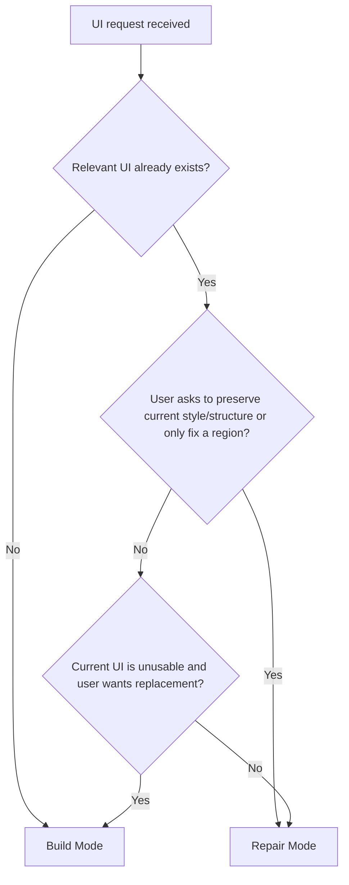

# UI Change Modes

Use this guide when a Unity UI request could be interpreted either as repairing existing UI or building a new UI from scratch.

## Goal

Choose the correct operating mode early so the agent does not redesign an existing screen when the task was a bounded repair, and does not over-preserve broken structure when the task was really a greenfield build.

## Two Modes

### 1. Repair Mode

Use this when the UI already exists and the user wants it fixed, aligned, stabilized, or brought closer to a reference.

Typical signals:

- "fix"
- "repair"
- "adjust"
- "align"
- "match this image"
- "keep the current style"
- "do not rebuild everything"

### 2. Build Mode

Use this when the screen does not exist yet or when the user clearly wants a fresh implementation.

Typical signals:

- "build"
- "create"
- "make this screen"
- "new HUD"
- "new popup"
- "from scratch"

## Decision Flow

## Repair Mode Rules

- Inspect the current UI before proposing structure changes.
- Keep scope bounded to the named region unless the parent chain forces a wider structural fix.
- Preserve existing style, prefab choices, and asset workflow unless they are the actual source of the problem.
- Prefer the smallest structural change that solves the issue.
- Explain when a wider change is required because the real problem lives in the parent container or shared prefab.

## Build Mode Rules

- Start from the root shell and main regions first.
- Treat the request as greenfield unless the user explicitly asks to inherit from existing UI.
- Create structure before visual polish.
- Use reusable blocks and prefab rules early if repetition is obvious.

## Mixed Cases

Some requests look like repair but actually need rebuild-level scope. In that case:

- still start in Repair Mode
- inspect the current screen first
- explicitly state why bounded repair is not enough
- then switch to Build Mode for the affected region only if needed

Do not silently jump from repair into redesign.

## Common Failure Pattern

The most common mistake is this:

- the user asks for a fix
- the agent treats the task like a new screen build
- unrelated layout and style drift are introduced

If that risk exists, default to Repair Mode until the need for a rebuild is proven.

## Verification Questions

- Did we identify whether this was a repair or a new build before editing?
- If this was a repair, did we keep scope bounded?
- If this was a build, did we avoid over-preserving broken old structure?
- If the mode changed mid-task, was that change explained clearly?
