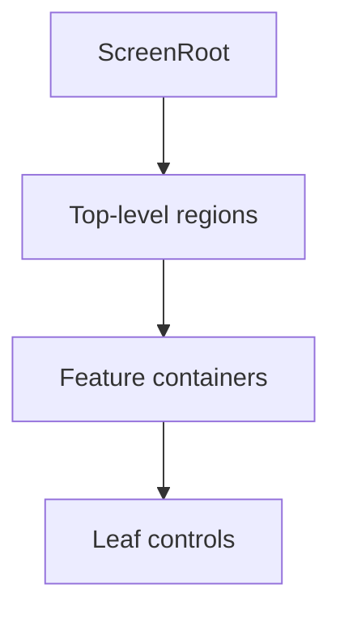

# UI Toolkit Layout Rules

Use this guide when the task is clearly in Unity UI Toolkit rather than UGUI.

The main rule is simple:

- let containers own layout
- let classes own repeatable style
- let text behavior be decided explicitly before emergency overrides

## 1. Start With the Visual Tree

Before changing styles, identify:

- the active `UIDocument`
- the main screen root
- the important container layers
- the `UXML` file that owns structure
- the `USS` file or files that own repeatable style

Do not begin with scattered inline edits before the container hierarchy is understood.

## 2. Ownership Model

UI Toolkit gets fragile when width, flex, spacing, and alignment ownership are scattered across many leaf nodes.

Use this ownership shape when possible:

- `ScreenRoot` owns overall screen flow
- top-level regions own major layout partitioning
- feature containers own spacing, grouping, and local flex behavior
- leaf controls should avoid re-declaring layout intent unless they are truly exceptional

## 3. Prefer Container Rules Over Leaf Overrides

When layout looks wrong, inspect in this order:

1. container direction
2. flex grow or shrink rules
3. width and height constraints
4. alignment and justification
5. spacing and padding
6. local overrides on leaf elements

If many leaf elements each carry one-off width, margin, or alignment patches, the layout probably needs container cleanup first.

## 4. Flex-Heavy Screen Rules

For flex-heavy screens such as settings, inventory side panels, dashboards, or editor-style inspectors:

- define which container owns horizontal split
- define which container owns vertical stacking
- use explicit min or max width rules where collapse would be harmful
- keep scroll ownership on one deliberate container
- avoid mixing too many competing `flex-grow` values without a clear hierarchy

If a screen should survive narrower widths, decide that behavior intentionally instead of trusting default flex resolution.

## 5. Text Behavior Is Structural

For UI Toolkit, text problems often come from leaving width and overflow behavior implicit.

Decide these intentionally:

- should the text wrap?
- should it truncate?
- should it keep one line with ellipsis?
- should the parent grow?

Treat these as structure decisions, not as last-minute visual tweaks.

## 6. Prefer Reusable USS Classes

Use classes for repeatable intent:

- text role
- row type
- button family
- panel family
- spacing rhythm

Avoid solving repeated problems with many inline overrides.

## 7. Narrow-Width Stability

UI Toolkit screens often look correct at one width and then collapse.

Before calling the layout done, check:

- which container should compress first
- which region should keep a minimum width
- where scrolling should begin
- whether text should wrap before siblings collapse

If none of those decisions were made deliberately, the screen is probably still fragile.

## 8. Anti-Patterns

Avoid these:

- fixing a flex issue with many leaf-level width overrides
- letting multiple nested containers all fight over scroll behavior
- scattering one-off margins instead of defining container gap or padding
- relying on implicit text overflow behavior
- keeping repeatable UI style only in inline rules instead of USS classes

## 9. Review Questions

Ask:

- Does each important UI Toolkit region have a clear container owner?
- Are flex, width, and spacing decisions concentrated in containers instead of leaves?
- Are text wrap and overflow behaviors explicit for important regions?
- Would a narrower width still produce an intentional result?
- Are reusable USS classes doing the heavy lifting where appropriate?

If the answer is no, the screen likely needs structural cleanup before more styling work.
